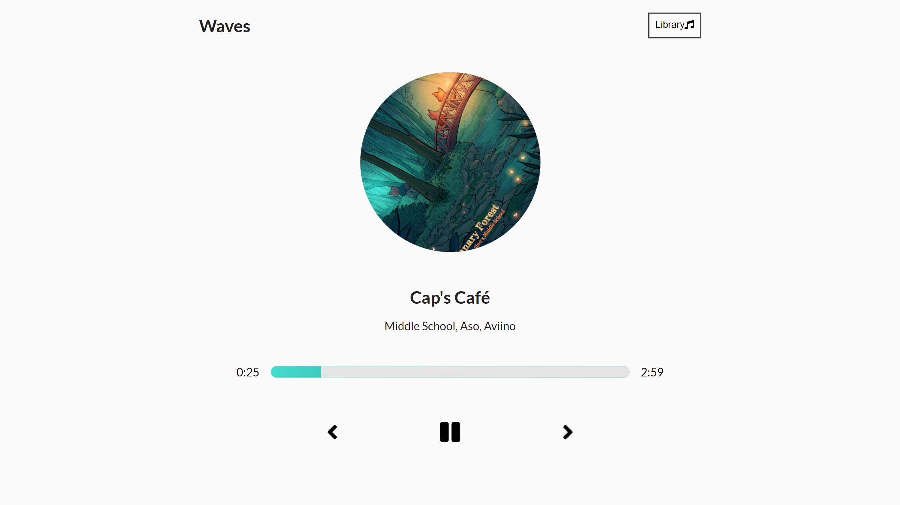
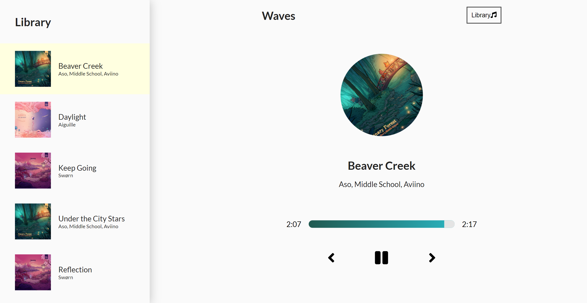

# Waves

A music player web app with an interactive UI and settled animations for easy access for the user.

# Installation

- 1 - npm install
- 2 - npm run start - Runs the app in development mode
- 3 - Open http://localhost:3000 to view it in the browser.

# Tech Stack

- ReactJS
- HTML5/CSS3

# Home Page

# Library Page

